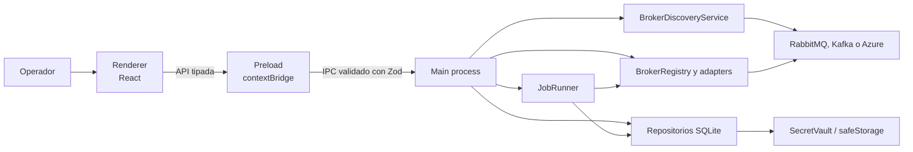
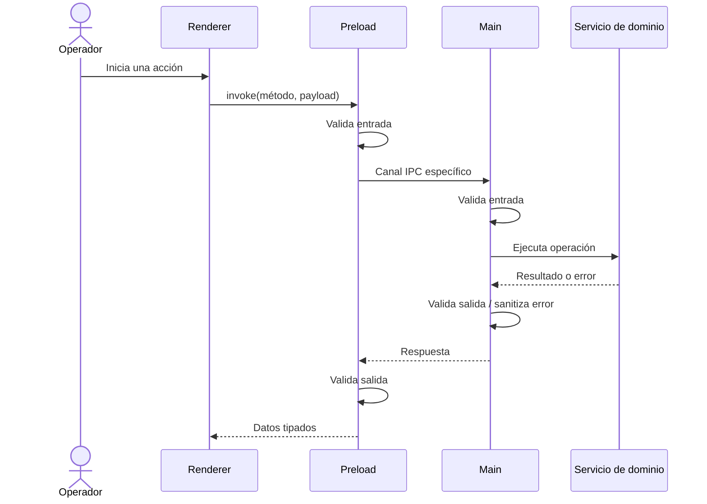
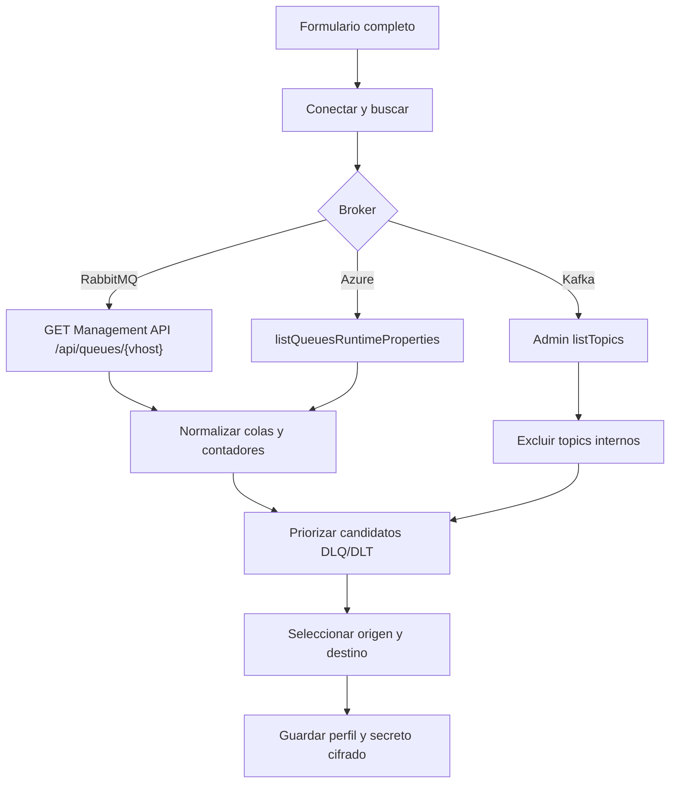
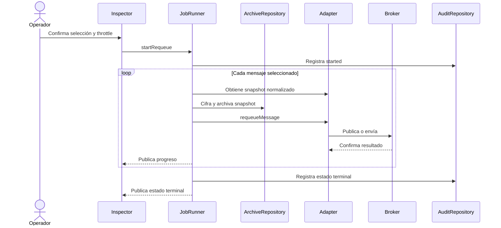

# Arquitectura

DLQCommander separa la interfaz no privilegiada de las capacidades de sistema y broker. Esta división permite usar SDKs de Node en una aplicación de escritorio sin entregar acceso directo a Electron, archivos o credenciales al renderer.

## Vista general



## Responsabilidades

| Límite | Responsabilidad | No debe hacer |
| --- | --- | --- |
| Renderer | Presentar vistas, gestionar formularios, filtrar y capturar intención | Importar Node/Electron, leer SQLite o conectar a brokers |
| Preload | Exponer `window.dlqCommander`, validar entrada y salida, transportar eventos de progreso | Exponer `ipcRenderer` genérico o secretos |
| Shared | Definir dominio, schemas Zod, capacidades y contrato IPC | Depender de APIs privilegiadas |
| Main | Crear la ventana, aplicar seguridad, coordinar servicios y registrar handlers IPC | Entregar errores sin sanitizar |
| Adapters | Traducir operaciones del dominio a semántica nativa del broker | Ocultar diferencias destructivas o append-only |
| Persistencia | Guardar perfiles, auditoría y snapshots en SQLite | Devolver secretos a la UI |

## Procesos Electron

### Renderer

React y TanStack Query componen Dashboard, Conexiones, Inspector, Auditoría y Ajustes. El renderer se ejecuta con `sandbox: true`, `contextIsolation: true` y `nodeIntegration: false`. Solo conoce perfiles sanitizados y mensajes normalizados.

### Preload

`src/preload/index.ts` publica dos capacidades:

- `invoke(method, payload)` para los métodos enumerados en `src/shared/ipc-contract.ts`;
- `onJobProgress(callback)` para recibir el estado de jobs.

Preload valida el payload antes de enviarlo y vuelve a validar la respuesta. Una respuesta que no cumple el schema se rechaza en la frontera.

### Main

El proceso principal posee los SDKs de brokers, `node:sqlite`, `safeStorage` y el ciclo de vida de jobs. Cada handler IPC vuelve a validar la entrada, ejecuta una responsabilidad concreta y normaliza errores antes de responder.

## Contrato IPC

Los métodos públicos incluyen salud local, perfiles, discovery, fuentes, mensajes, jobs y auditoría. `src/shared/ipc-contract.ts` es la fuente única de canales y schemas.



## Discovery antes de guardar

`BrokerDiscoveryService` opera sin un perfil persistido. Recibe endpoint y credenciales en memoria, aplica un timeout uniforme de 15 segundos y devuelve entidades normalizadas con nombre, tipo, contador opcional y señal de fuente sugerida.



RabbitMQ envía Basic Auth en headers y codifica el virtual host. Kafka siempre desconecta el cliente Admin. Azure usa el cliente administrativo únicamente durante discovery. Ninguna credencial aparece en la respuesta.

## Inspección

`BrokerRegistry` crea y conserva un adapter por perfil. Cada adapter produce `SourceSummary` y `NormalizedMessage`, de modo que la UI comparte tabla y panel de detalle aunque la lectura nativa sea diferente.

- RabbitMQ recibe un mensaje y lo devuelve a la cola con `nack(requeue=true)`.
- Kafka lee desde el inicio con un consumer group efímero sin commits.
- Azure usa peek nativo sobre la subcola dead-letter.
- Demo lee estructuras en memoria.

Estas operaciones no tienen garantías equivalentes. [Semántica por broker](broker-semantics.md) documenta sus efectos observables.

## Requeue y auditoría



El JobRunner aplica el límite de velocidad de forma secuencial y mantiene los jobs en memoria. La cancelación es cooperativa. Antes de cada requeue intenta archivar el mensaje normalizado; si el cifrado no está disponible, la operación falla cerrada.

## Persistencia local

La base se crea en:

```text
app.getPath('userData')/dlq-commander.db
```

En Windows instalado, `app.getPath('userData')` normalmente corresponde al directorio de datos de la aplicación dentro del perfil del usuario. El valor exacto depende de Electron y del entorno; no se codifica una ruta absoluta.

SQLite usa WAL y foreign keys. Las tablas actuales almacenan:

| Tabla | Contenido |
| --- | --- |
| `connection_profiles` | Nombre, broker, configuración no secreta y secreto cifrado |
| `audit_entries` | Inicio y resultado de operaciones |
| `archived_messages` | Hash y snapshot cifrado previo al requeue |
| `schema_migrations` | Versión aplicada del esquema |
| `saved_filters` | Estructura reservada; la UI no expone filtros guardados |
| `settings` | Estructura reservada; el tema se guarda actualmente en `localStorage` |

`SecretVault` serializa secretos a JSON y usa `safeStorage.encryptString`. El renderer recibe el perfil sin `encrypted_secret`. Los snapshots guardan el mensaje normalizado cifrado y un hash SHA-256 en claro para correlación.

## Seguridad de la ventana

Main bloquea navegación no controlada, creación de ventanas y solicitudes de permisos. La sesión aplica Content Security Policy para recursos locales. El modelo completo, riesgos residuales y manejo de secretos se documentan en [Modelo de seguridad](security-model.md).

## Estructura del código

```text
src/
  main/       brokers, jobs, seguridad, IPC y persistencia
  preload/    API limitada expuesta al renderer
  renderer/   React, vistas, componentes y estilos
  shared/     dominio, schemas y contrato IPC
tests/
  unit/       reglas aisladas y repositorios
  integration/adapters contra brokers reales
  e2e/        aplicación Electron con Demo
  e2e-brokers/aplicación Electron con Docker
```

Las decisiones que justifican los límites principales se conservan como [ADRs](adr/001-electron-typescript.md).
