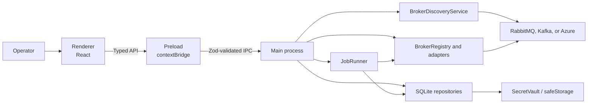
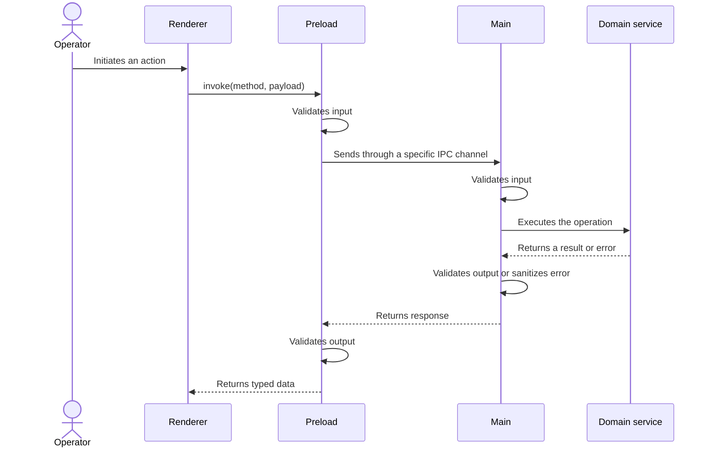
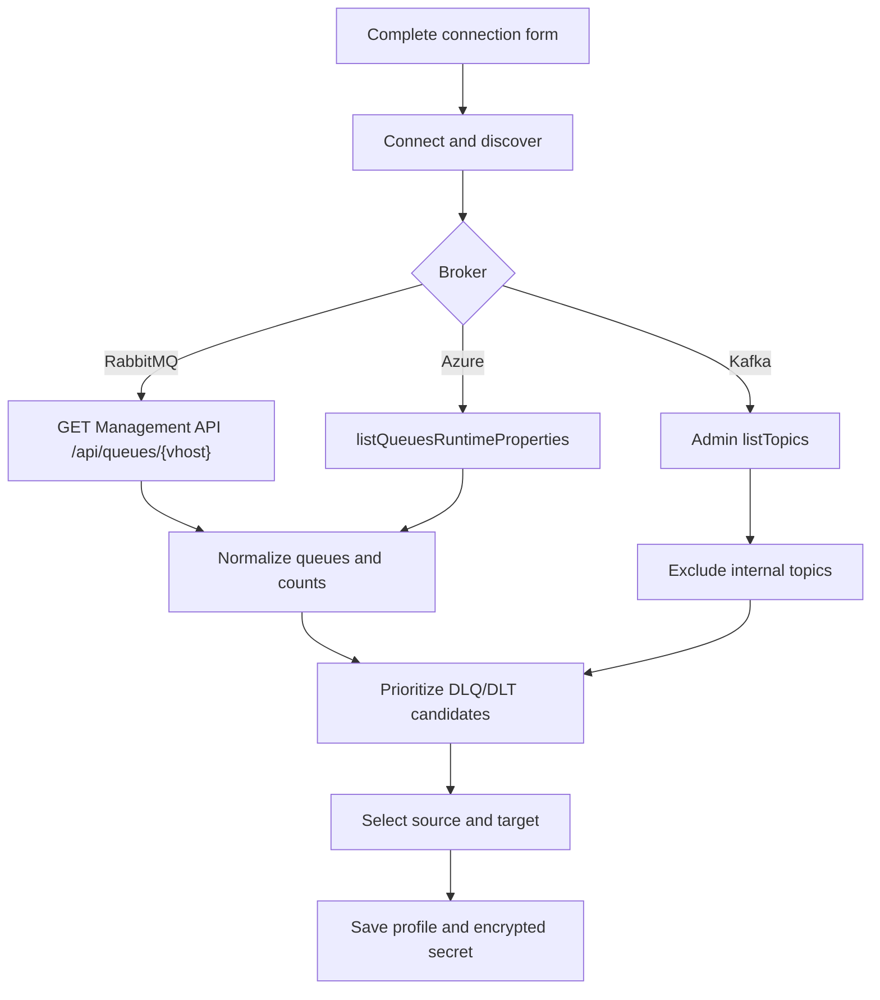
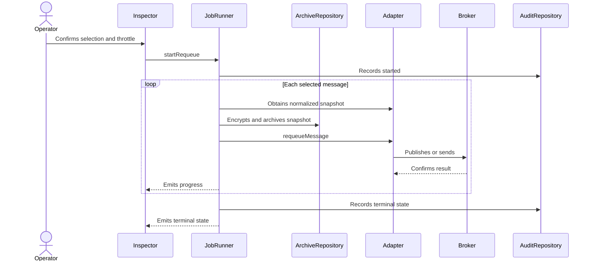

# Architecture

DLQCommander separates its unprivileged interface from system and broker capabilities. This boundary allows a desktop application to use Node.js SDKs without giving the renderer direct access to Electron, files, or credentials.

## System overview



## Responsibilities

| Boundary | Responsibility | Must not |
| --- | --- | --- |
| Renderer | Render views, manage forms, filter data, and capture user intent | Import Node/Electron, read SQLite, or connect to brokers |
| Preload | Expose `window.dlqCommander`, validate input and output, transport progress events | Expose a generic `ipcRenderer` or credentials |
| Shared | Define domain types, Zod schemas, capabilities, and the IPC contract | Depend on privileged APIs |
| Main | Create the window, apply security controls, coordinate services, and register IPC handlers | Return unsanitized errors |
| Adapters | Translate domain operations into native broker semantics | Hide destructive or append-only differences |
| Persistence | Store profiles, audit entries, and snapshots in SQLite | Return secrets to the UI |

## Electron processes

### Renderer

React and TanStack Query implement the Dashboard, Connections, Inspector, Audit, and Settings views. The renderer runs with `sandbox: true`, `contextIsolation: true`, and `nodeIntegration: false`. It sees only sanitized profiles and normalized messages.

### Preload

`src/preload/index.ts` exposes two capabilities:

- `invoke(method, payload)` for methods enumerated in `src/shared/ipc-contract.ts`;
- `onJobProgress(callback)` for job status events.

Preload validates a payload before sending it and validates the response again. A response that does not satisfy its schema is rejected at the boundary.

### Main

The main process owns broker SDKs, `node:sqlite`, `safeStorage`, and the job lifecycle. Every IPC handler validates input again, invokes one focused responsibility, and normalizes errors before returning.

## IPC contract

Public methods cover local health, profiles, discovery, sources, messages, jobs, and audit history. `src/shared/ipc-contract.ts` is the single source of channel names and schemas.



## Discovery before persistence

`BrokerDiscoveryService` operates without a saved profile. It receives an endpoint and credentials in memory, applies a uniform 15-second timeout, and returns normalized entities containing a name, type, optional count, and suggested-source flag.



RabbitMQ sends Basic Auth in headers and encodes the virtual host. Kafka always disconnects the Admin client. Azure uses its administration client only during discovery. Credentials never appear in the response.

## Inspection

`BrokerRegistry` creates and retains one adapter per profile. Every adapter produces `SourceSummary` and `NormalizedMessage` values, allowing the UI to reuse one table and details panel even though native read semantics differ.

- RabbitMQ receives a message and returns it with `nack(requeue=true)`.
- Kafka reads from the beginning with an ephemeral consumer group and no commits.
- Azure performs a native peek on the dead-letter subqueue.
- Demo reads in-memory structures.

These operations do not provide equivalent guarantees. [Broker semantics](broker-semantics.md) documents their observable effects.

## Requeue and audit



JobRunner applies the rate limit sequentially and keeps jobs in memory. Cancellation is cooperative. Before every requeue, it attempts to archive the normalized message; if encryption is unavailable, the operation fails closed.

## Local persistence

The database is created at:

```text
app.getPath('userData')/dlq-commander.db
```

In an installed Windows application, `app.getPath('userData')` normally resolves to the application's data directory in the current user profile. The exact location depends on Electron and the environment; no absolute path is hard-coded.

SQLite uses WAL and foreign keys. Current tables store:

| Table | Content |
| --- | --- |
| `connection_profiles` | Name, broker, non-secret configuration, and encrypted secret |
| `audit_entries` | Operation start and result records |
| `archived_messages` | Hash and encrypted pre-requeue snapshot |
| `schema_migrations` | Applied schema version |
| `saved_filters` | Reserved structure; the UI does not expose saved filters |
| `settings` | Reserved structure; the theme currently uses `localStorage` |

`SecretVault` serializes secrets as JSON and calls `safeStorage.encryptString`. The renderer receives profiles without `encrypted_secret`. Snapshots store the encrypted normalized message and a plaintext SHA-256 hash for correlation.

## Window security

Main blocks uncontrolled navigation, new-window creation, and permission requests. The session applies a Content Security Policy for local resources. [Security model](security-model.md) documents the complete model, residual risks, and secret handling.

## Code structure

```text
src/
  main/       brokers, jobs, security, IPC, and persistence
  preload/    limited API exposed to the renderer
  renderer/   React application, components, views, and styles
  shared/     domain, schemas, capabilities, and IPC contract
tests/
  unit/       isolated rules and repositories
  integration/ adapters against real brokers
  e2e/        Electron application with Demo
  e2e-brokers/ Electron application with Docker
```

The decisions behind the primary boundaries are preserved as [ADRs](adr/001-electron-typescript.md).
