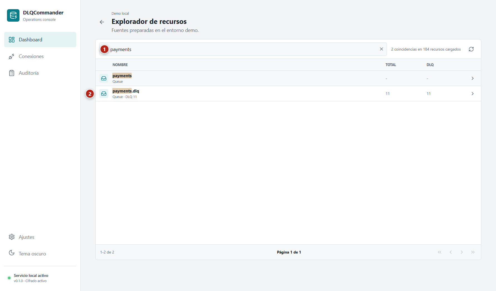
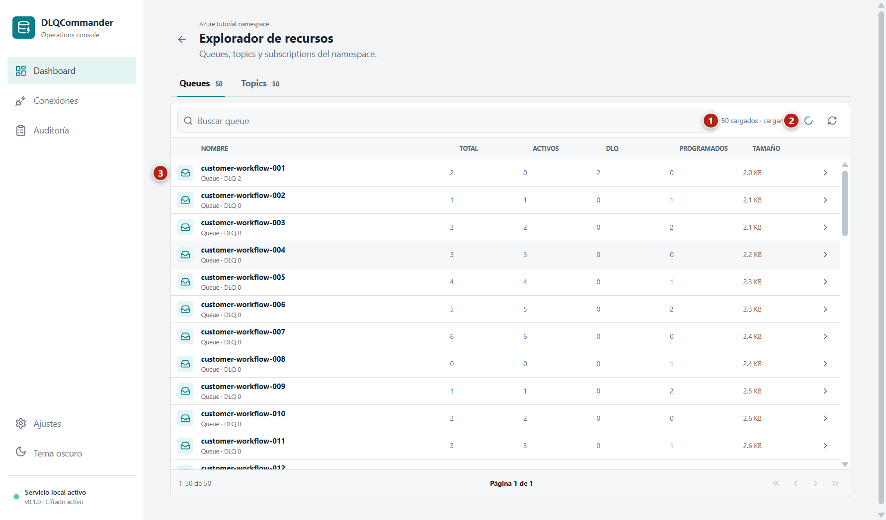
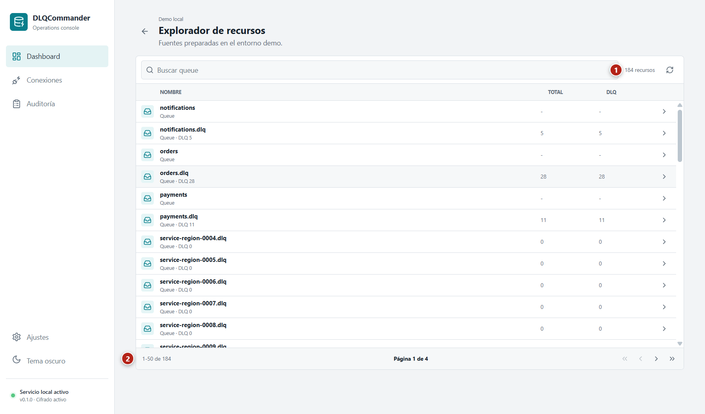
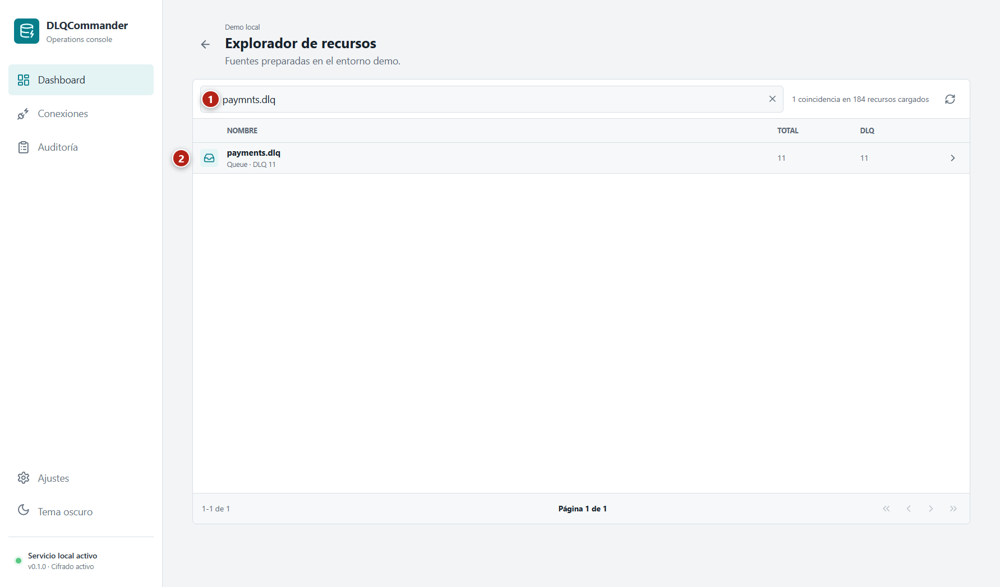
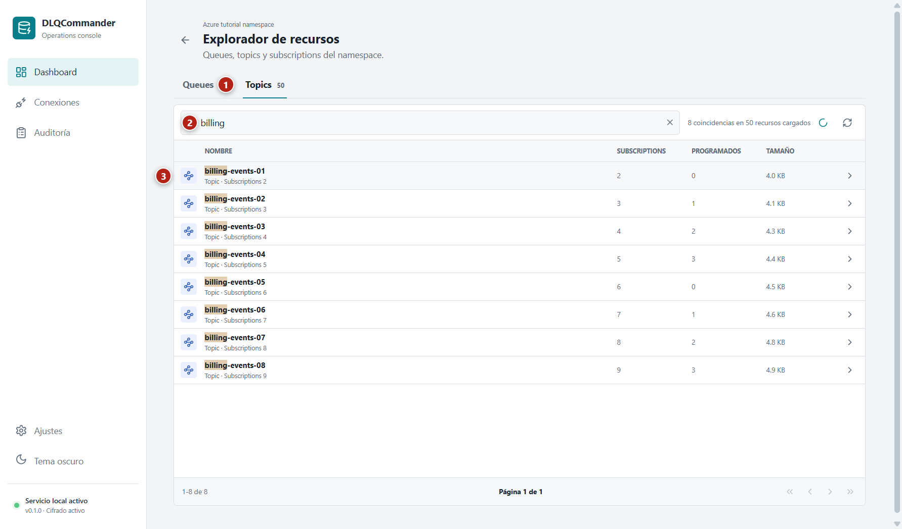
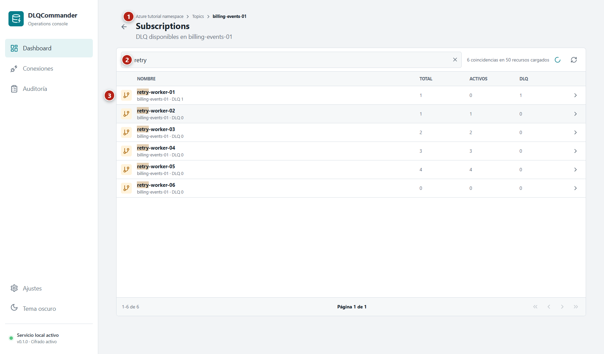
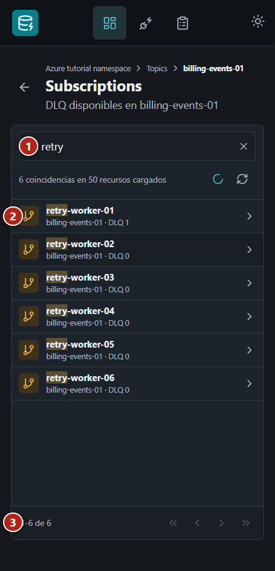

# User guide

This guide explains how to connect a broker namespace, find resources, inspect dead-letter messages, and perform a controlled requeue. The application UI is currently in Spanish; literal screen and control names appear in **bold**.

All tutorial screenshots use the local Demo profile or Docker lab. They contain no external credentials.

## Before operating

DLQCommander can modify real messages. New profiles start in **Solo lectura** (Read only) mode. Before enabling operations:

1. Confirm the broker and namespace.
2. Confirm that the selected queue, topic, or subscription is the intended source.
3. Review the [broker semantics](broker-semantics.md).
4. Run **Probar** from **Conexiones**.
5. Verify the destination in the requeue confirmation.
6. Choose a throttle compatible with the receiving application.

## First walkthrough

### Open DLQCommander

Run `pnpm dev` or open the installed application. The first launch creates **Demo local**.

*Action:* identify navigation (1), connection metrics (2), and the connections table (3). *Expected result:* **Demo local** is available without external infrastructure.

The Dashboard lists connections rather than every broker resource. This keeps the first screen usable when a namespace contains hundreds of queues or topics.

### Explore the Demo namespace

Select **Demo local**. The resource explorer opens with its search field focused.

*Action:* type part of a resource name (1) and open a matching row (2). *Expected result:* filtering happens immediately without another broker request.

### Change appearance

Open **Ajustes** and choose **Sistema**, **Claro**, or **Oscuro**. The preference is retained locally.

*Action:* select **Oscuro** (1) or use the sidebar theme action (2). *Expected result:* the complete application changes theme without restarting.

## Create a connection

### Prerequisites

- The workstation can reach the broker endpoint.
- Credentials have the permissions listed in [Broker configuration](broker-configuration.md).
- RabbitMQ Management API is enabled and reachable for namespace exploration.
- The profile name identifies the environment and purpose.

### Open the form

Open **Conexiones** and select **Nueva conexión**.

*Action:* select **Nueva conexión** (1). *Expected result:* **Conectar broker** opens and focus moves to **Nombre del perfil**.

### Enter broker settings

Choose the broker and complete its fields:

| Broker | Required data |
| --- | --- |
| RabbitMQ | Host, AMQP port, virtual host, username, password, and optional TLS |
| Azure Service Bus | Namespace connection string |
| Kafka | Bootstrap servers and Client ID |

RabbitMQ **Opciones avanzadas** can override the derived Management URL. Credentials must never be included in that URL.

### Connect and search

Select **Conectar y buscar**. Discovery has a 15-second timeout and blocks duplicate requests.

*Action:* review loading progress (1), search by name while more pages arrive (2), and optionally select a resource to open after saving (3). *Expected result:* queues and topics visible to the credential appear in pages of 50 without waiting for the complete namespace before the first results are usable.

Saving a namespace does not require a source or destination. **Guardar y explorar** stores the endpoint and encrypted credential, then opens the resource explorer. A selected Azure topic opens its subscriptions; a selected inspectable resource opens its Inspector.

The connection cannot be saved until every page has loaded. If an intermediate page fails, the preview keeps earlier pages and offers **Reintentar desde aquí**. Changing the broker, endpoint, credentials, virtual host, or Management URL discards every page from the previous attempt.

### Use manual fallback

If administrative discovery is unavailable, choose **Ingresar manualmente**.

*Action:* select manual mode (1), enter the source (2), and enter the destination (3). *Expected result:* **Guardar ruta fija** becomes available.

Manual mode creates a fixed-route profile. Azure manual mode supports a queue source or a topic/subscription source. Manual entry avoids enumeration permissions but does not bypass permissions required to inspect or requeue.

### Test a saved connection

Return to **Conexiones**, locate the profile, and select **Probar**. Namespace profiles validate broker connectivity and resource discovery. Legacy and manually created fixed profiles validate their configured source.

Profiles can be tested, explored, or deleted. Editing an existing profile is not currently available.

## Explore resources

### Search large namespaces

Open a connection from Dashboard or select **Explorar** under **Conexiones**. The first broker page appears as soon as it is available, and DLQCommander continues requesting subsequent pages sequentially in the background. Azure queues and topics load concurrently; subscriptions remain lazy until a topic is opened. Every collection is cached for 60 seconds.

*Action:* review the loaded count (1), background activity (2), and immediately available rows (3). *Expected result:* the catalog remains usable while the count increases until the final total replaces the loading state.

- RabbitMQ displays queues.
- Kafka displays non-internal topics.
- Azure displays separate **Queues** and **Topics** tabs.
- Demo displays its built-in queues.

*Action:* use first, previous, next, or last page (1) while reviewing the loaded-resource status (2). *Expected result:* the visible result set contains at most 50 rows and only the rows in the viewport enter the DOM.

With an empty query, resources use natural alphabetical order, matching the Azure Portal scanning model. The footer reports the visible range, current page, and total pages. During background loading, the toolbar reports values such as `150 cargados · cargando...`; when complete, it reports the final resource count.

Search is local and never sends a broker request for each keystroke. It ignores case and accents, treats dots, slashes, underscores, spaces, and hyphens as segment boundaries, and requires every entered term. Ranking is deterministic:

1. exact name or full path;
2. name prefix;
3. segment prefix;
4. substring, equivalent to local `ILIKE '%text%'` behavior;
5. typo-tolerant Fuse matching when no direct match exists;
6. natural alphabetical order within the same rank.

*Action:* enter an incomplete or slightly misspelled name (1). *Expected result:* the closest resource remains discoverable and the status states how many matches exist in the currently loaded catalog.

### Open Azure subscriptions

Select the Azure **Topics** tab, search for a topic, and open it. DLQCommander lazily requests only that topic's subscriptions. The breadcrumb identifies the active topic, and the subscription search remains local after loading.

*Action:* switch to **Topics**, search the catalog (1), and open a topic row (2). *Expected result:* topic rows show subscription, scheduled-message, and size metrics when Azure provides them.

*Action:* follow the topic breadcrumb (1) and search subscriptions (2). *Expected result:* subscriptions show total, active, and DLQ counts and can be opened as DLQ sources.

Azure topics are navigation containers and valid requeue destinations. Their subscriptions are inspectable DLQ sources and cannot be selected as destinations.

*Action:* repeat the search on a narrow viewport (1), open a stacked row (2), or change pages (3). *Expected result:* the resource name and primary metric remain readable without horizontal scrolling.

### Refresh

Select the refresh icon in the catalog toolbar to invalidate that collection's 60-second cache and restart from page one. A failed intermediate page leaves the already loaded rows searchable and offers **Reintentar desde aquí**. Permission, network, empty, and stale states remain inside the explorer so navigation and theme controls stay available.

## Inspect messages

### Load and filter

Open an inspectable queue, Kafka topic, or Azure subscription. DLQCommander initially requests 100 messages.

*Action:* filter by ID, cause, header, or payload (1), review failure data (2), and select a message (3). *Expected result:* the status reports matches and loaded messages without modifying the broker.

When more messages exist, **Cargar 100 más** expands the inspected window. The maximum is 500 messages per inspection session. Search covers only loaded messages; DLQCommander never presents this as a complete broker-wide scan.

### Review details

Select a row to open the message panel.

*Action:* switch between **Payload**, **Headers**, and **Metadata** (1). *Expected result:* normalized content and the SHA-256 hash appear without losing table selection.

### Understand broker warnings

- RabbitMQ uses `basic.get` followed by `nack(requeue=true)` and can change ordering.
- Kafka reads without commits; requeue copies the record and leaves the DLT unchanged.
- Azure peeks the native queue or subscription dead-letter subqueue.
- Demo uses non-durable in-memory data.

## Perform a requeue

### Select messages

The profile must have operations enabled. Select one or more visible messages.

*Action:* select messages (1) and review the count in **Requeue** (2). *Expected result:* only selected message IDs enter the operation.

### Choose a destination

Open **Requeue**. The confirmation loads valid destinations from the same connection:

- RabbitMQ queues;
- Kafka topics;
- Azure queues and topics.

*Action:* verify the summary (1), search and select a destination (2), adjust **Máximo por segundo** (3), then confirm or cancel (4). *Expected result:* confirmation stays disabled until a valid destination is available.

After at least one message succeeds, DLQCommander remembers the destination for that profile and source. The remembered value is preselected on the next operation and can be changed before confirmation.

### Monitor and audit

The Inspector reports job progress. On completion, open **Auditoría**.

*Action:* compare requested, successful, failed, source, destination, and status values (1). *Expected result:* started and terminal records identify the operation outcome.

## Keyboard navigation

- `Tab` and `Shift+Tab` move through navigation and commands.
- Resource search supports `Arrow Up`, `Arrow Down`, `Home`, `End`, `Page Up`, `Page Down`, and `Enter`.
- The four paginator buttons move to the first, previous, next, and last visible page.
- `Escape` clears a resource query before closing the surrounding dialog.
- `Enter` or `Space` opens a focused Dashboard connection.
- Visible focus identifies the active control, and status changes use accessible live regions.

## Troubleshooting

| Symptom | Action |
| --- | --- |
| **Conectar y buscar** is disabled | Complete the required endpoint and credential fields. |
| Results become stale | Run **Buscar nuevamente** after changing connection data. |
| RabbitMQ cannot enumerate queues | Verify Management API access or use a fixed manual route. |
| An Azure topic cannot be inspected | Open the topic and choose one of its subscriptions. |
| Search does not find an old message | Load more messages; search only covers the current inspected window. |
| **Confirmar requeue** is disabled | Select a valid destination and verify that the profile is writable. |
| Kafka still contains the DLT record | This is expected append-only behavior. |

For incident procedures, see the [Operations runbook](operations-runbook.md).
