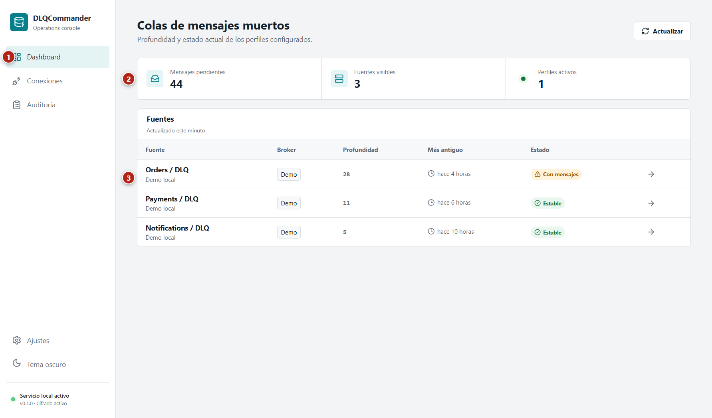
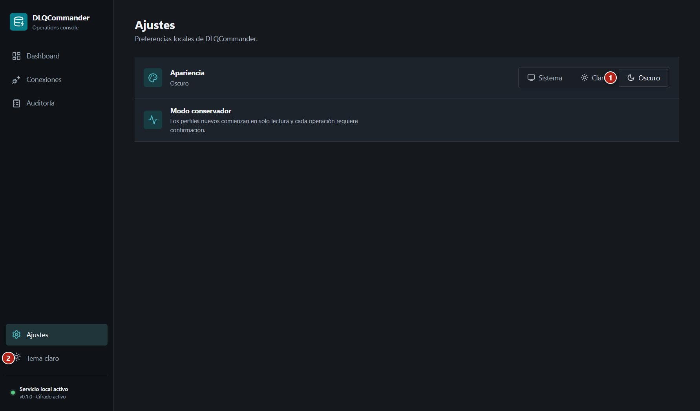
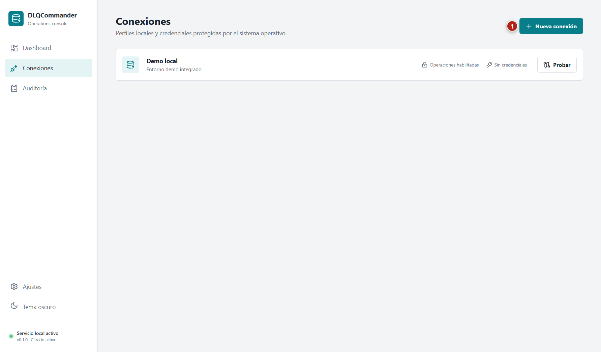
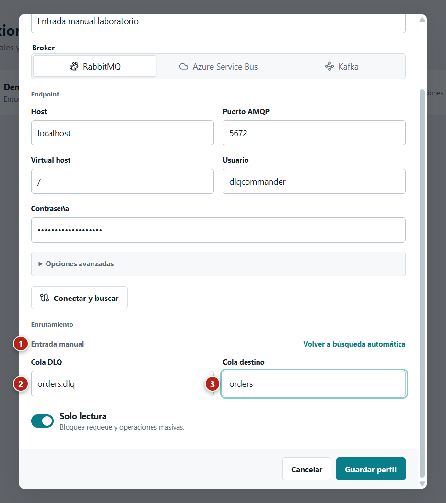
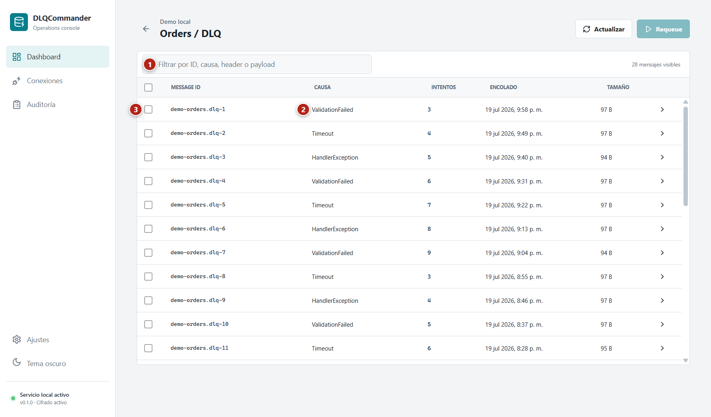
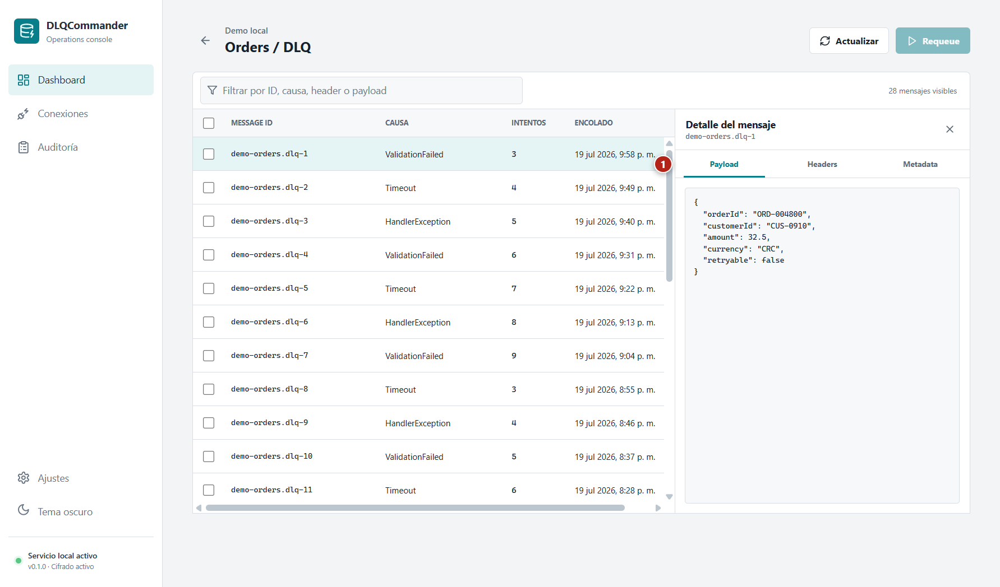
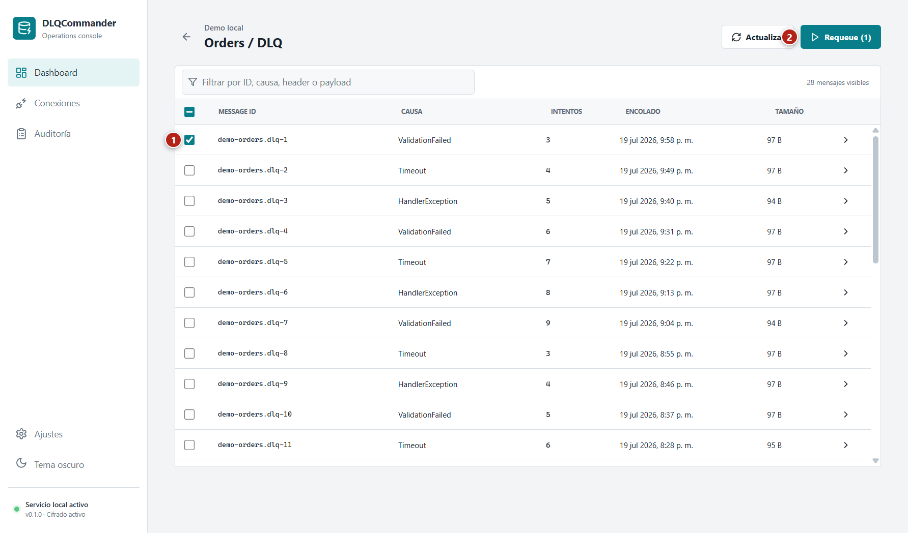
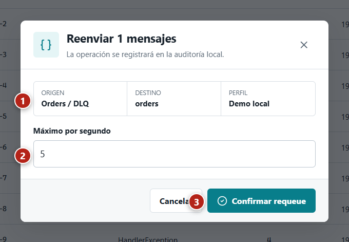
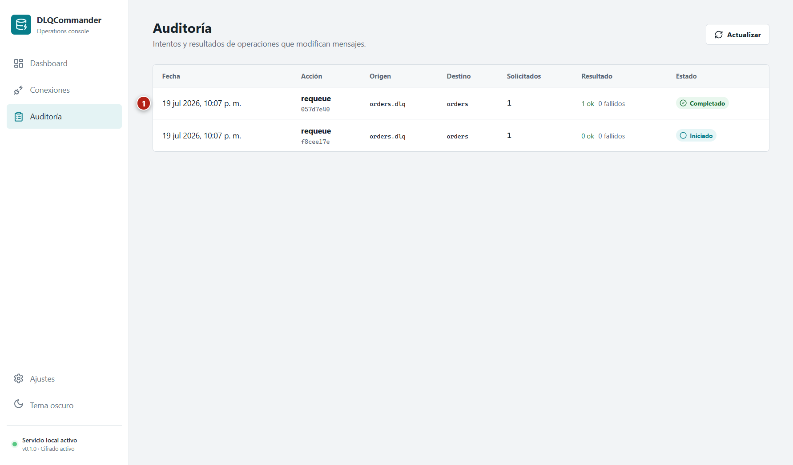

# Guía de usuario

Esta guía explica cómo recorrer DLQCommander, crear una conexión, inspeccionar mensajes y ejecutar requeue. Las capturas se generan con datos temporales y el laboratorio local; no contienen credenciales externas.

## Antes de operar

DLQCommander puede modificar mensajes reales. Los perfiles nuevos se crean en **Solo lectura** para que el operador valide endpoint, fuente y destino antes de habilitar operaciones.

Antes de desactivar esa protección:

1. Confirme que la fuente corresponde a una DLQ o DLT.
2. Confirme que el destino es la cola o topic consumido por la aplicación correcta.
3. Revise la [semántica del broker](broker-semantics.md), en especial el comportamiento append-only de Kafka.
4. Ejecute **Probar** desde **Conexiones**.
5. Acuerde un throttle compatible con la capacidad del consumidor destino.

## Primer recorrido

### 1. Abrir DLQCommander

Ejecute `pnpm dev` desde el repositorio o abra la aplicación instalada. En el primer arranque, DLQCommander crea el perfil **Demo local** y muestra sus fuentes en el Dashboard.

*Acción:* identifique la navegación (1), las métricas agregadas (2) y la tabla de fuentes (3). *Resultado esperado:* aparecen **Orders / DLQ**, **Payments / DLQ** y **Notifications / DLQ** sin configurar un broker.

### 2. Interpretar el Dashboard

El encabezado resume el estado observable en ese momento:

- **Mensajes pendientes:** suma de la profundidad informada por todas las fuentes.
- **Fuentes visibles:** cantidad de DLQ o DLT configuradas.
- **Perfiles activos:** cantidad de perfiles locales.
- **Más antiguo:** antigüedad del primer mensaje que el adapter pudo observar.
- **Estado:** saludable, con advertencia o con error según profundidad y conectividad.

El Dashboard consulta los brokers cada 15 segundos. **Actualizar** fuerza una consulta inmediata. Un fallo en un perfil aparece como aviso y no elimina los demás perfiles.

### 3. Usar el perfil Demo

Seleccione **Orders / DLQ**. El Demo admite inspección y requeue sin infraestructura externa. Sus datos se reconstruyen al reiniciar la aplicación; sirven para aprender el flujo, no para conservar evidencia operativa.

### 4. Cambiar la apariencia

Abra **Ajustes** y elija **Sistema**, **Claro** u **Oscuro**. La opción Sistema sigue la preferencia de Windows; las otras dos fijan el tema. La selección se conserva en el almacenamiento local del renderer.

*Acción:* seleccione **Oscuro** (1) o use el acceso rápido de la barra lateral (2). *Resultado esperado:* la interfaz cambia sin reiniciar y mantiene la preferencia al volver a abrirla.

## Crear una conexión

### Prerrequisitos

- El equipo puede alcanzar el endpoint del broker.
- Las credenciales tienen los permisos descritos en [Configuración de brokers](broker-configuration.md).
- Para RabbitMQ, Management Plugin está habilitado y su API HTTP es accesible.
- El nombre del perfil identifica el entorno y propósito, por ejemplo `Producción pagos`.

### 1. Abrir el formulario

Abra **Conexiones** y pulse **Nueva conexión**.

*Acción:* pulse **Nueva conexión** (1). *Resultado esperado:* se abre el diálogo **Conectar broker** y el foco queda en **Nombre del perfil**.

### 2. Seleccionar el broker

Elija **RabbitMQ**, **Azure Service Bus** o **Kafka**. El formulario muestra únicamente los campos aplicables:

| Broker | Datos solicitados |
| --- | --- |
| RabbitMQ | Host, puerto AMQP, virtual host, usuario, contraseña y TLS opcional |
| Azure Service Bus | Connection string |
| Kafka | Bootstrap servers y Client ID |

En RabbitMQ, **Opciones avanzadas** permite sobrescribir la Management URL derivada. No incluya usuario ni contraseña en esa URL.

### 3. Conectar y descubrir recursos

Complete endpoint y credenciales y pulse **Conectar y buscar**. La operación tiene un timeout de 15 segundos. Durante la consulta, el formulario bloquea solicitudes duplicadas.

*Acción:* revise el resultado (1), elija la fuente (2) y el destino (3). *Resultado esperado:* la lista contiene las colas o topics visibles para la credencial y **Guardar perfil** solo se habilita cuando ambas selecciones son válidas.

DLQCommander ordena primero recursos con mensajes o nombres compatibles con DLQ/DLT. No oculta los demás. Si existe una única candidata sugerida, la preselecciona como fuente y destino; cambie el destino antes de guardar cuando corresponda.

### 4. Recuperarse de un discovery fallido

Si cambian endpoint, credenciales, virtual host o Management URL después del discovery, los resultados quedan obsoletos. Pulse **Buscar nuevamente** para evitar guardar selecciones obtenidas con otra conexión.

Cuando la credencial no puede listar recursos, el formulario ofrece **Reintentar** e **Ingresar manualmente**.

*Acción:* pulse **Ingresar manualmente** (1) y escriba fuente (2) y destino (3). *Resultado esperado:* el perfil puede guardarse sin discovery, pero el broker validará los nombres al usar **Probar** o abrir la fuente.

La entrada manual no evita los permisos necesarios para inspeccionar o reenviar mensajes; solo evita el permiso administrativo de enumerar recursos.

### 5. Guardar y probar

Mantenga **Solo lectura** activo durante la primera verificación y pulse **Guardar perfil**. Las credenciales se cifran con el mecanismo del sistema operativo antes de persistirse.

En la lista de conexiones:

1. Localice el perfil por nombre.
2. Pulse **Probar**.
3. Espere un aviso con el resultado y la latencia.
4. Abra el Dashboard y confirme que la fuente aparece con el nombre y profundidad esperados.

La interfaz actual permite probar y eliminar perfiles, pero no editarlos. Para corregir un endpoint, credencial o enrutamiento, elimine y cree de nuevo el perfil.

## Inspeccionar mensajes

### 1. Abrir una fuente

Desde el Dashboard, seleccione una fila. DLQCommander solicita hasta 250 mensajes y presenta cualquier advertencia específica del broker antes de la tabla.

*Acción:* use el filtro (1), revise causa e intentos (2) y seleccione un mensaje (3). *Resultado esperado:* la lista se filtra por ID, causa, header o payload sin modificar el broker.

### 2. Revisar el detalle

Seleccione la fila de un mensaje para abrir el panel lateral.

*Acción:* cambie entre **Payload**, **Headers** y **Metadata** (1). *Resultado esperado:* el panel muestra el contenido normalizado, propiedades del broker y hash SHA-256 sin perder la selección de la tabla.

**Payload** muestra texto o JSON legible. **Headers** muestra propiedades de aplicación. **Metadata** reúne causa, descripción, intentos, content type, fecha y `rawHash`. El hash permite correlacionar evidencia sin copiar el body a otro sistema.

### 3. Interpretar profundidad y advertencias

- RabbitMQ informa profundidad exacta, pero la inspección usa receive-and-release y puede alterar el orden.
- Kafka calcula profundidad desde offsets; leer no hace commit y el requeue no reduce la DLT.
- Azure informa el contador exacto con permiso `Manage`; sin él, muestra al menos el tamaño de la muestra observable.
- Demo usa datos en memoria y no representa durabilidad real.

## Ejecutar requeue

### Prerrequisitos

- El perfil no está en **Solo lectura**.
- La fuente tiene un destino configurado.
- El operador conoce la semántica del broker y tiene autorización para modificar mensajes.

### 1. Seleccionar mensajes

Marque uno o varios mensajes. La cabecera permite seleccionar todos los mensajes visibles después de aplicar un filtro.

*Acción:* marque los mensajes (1) y revise el contador del botón **Requeue** (2). *Resultado esperado:* el botón indica exactamente cuántos mensajes se enviarán.

### 2. Revisar la confirmación

Pulse **Requeue**. El diálogo resume origen, destino, perfil y máximo de mensajes por segundo.

*Acción:* verifique el resumen (1), ajuste **Máximo por segundo** (2) y pulse **Confirmar requeue** o **Cancelar** (3). *Resultado esperado:* cancelar no crea una operación; confirmar inicia un job y registra su estado.

El throttle acepta valores entre `0.2` y `100` mensajes por segundo. La cancelación es cooperativa: detiene el siguiente mensaje pendiente, pero no revierte los que el broker ya confirmó.

### 3. Comprobar progreso y auditoría

El Inspector muestra mensajes procesados, total y estado terminal. Cuando termina, abra **Auditoría**.

*Acción:* compare solicitados, exitosos, fallidos y estado (1). *Resultado esperado:* existe una entrada iniciada y una entrada terminal que permiten correlacionar la operación con origen y destino.

Un lote puede terminar con mensajes exitosos y fallidos. No repita el lote completo: actualice el Inspector y seleccione únicamente los mensajes que sigan disponibles.

## Navegación por teclado

- `Tab` y `Shift+Tab` recorren navegación, formularios, tablas y acciones.
- `Enter` o `Espacio` abre una fuente enfocada en el Dashboard.
- Las listas de recursos aceptan escritura, flechas, `Enter` y `Escape`.
- `Escape` cierra el detalle, la confirmación o el formulario cuando no hay una operación pendiente.
- El foco visible indica el control activo; los avisos de estado se anuncian mediante regiones accesibles.

## Solución rápida de problemas

| Síntoma | Acción |
| --- | --- |
| **Conectar y buscar** está deshabilitado | Complete todos los campos de endpoint y credenciales requeridos. |
| El discovery pierde sus selecciones | Algún dato de conexión cambió; ejecute **Buscar nuevamente**. |
| El perfil se guarda, pero **Probar** falla | Revise nombres escritos manualmente y permisos de inspección. |
| **Requeue** permanece deshabilitado | Verifique selección, destino y que el perfil no sea de solo lectura. |
| Kafka conserva el registro en la DLT | Es el comportamiento esperado; confirme la copia en destino y la auditoría. |
| La profundidad de Azure parece menor | Use una credencial con `Manage` para consultar runtime properties. |

Para diagnóstico y recuperación operativa, consulte el [Runbook](operations-runbook.md).
